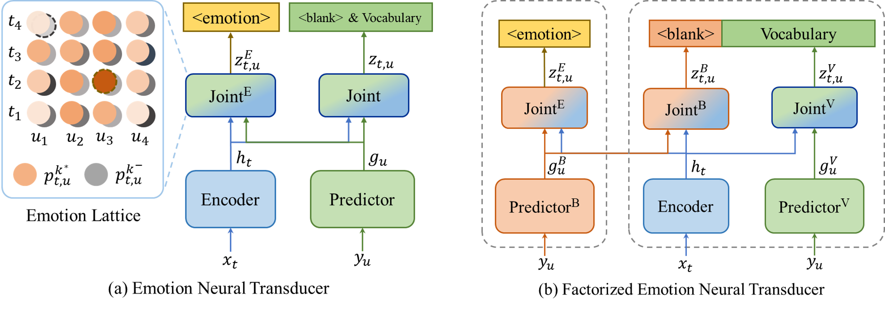

# Emotion Neural Transducer for Fine-Grained Speech Emotion Recognition

Code for ICASSP 2024 paper "Emotion Neural Transducer for Fine-Grained Speech Emotion Recognition".



## Libraries and Dependencies
 - [pytorch](https://github.com/pytorch/pytorch)
 - [torchaudio](https://github.com/pytorch/audio) (For data processing and loss function)
 - [transformers](https://huggingface.co) (For pretrained wav2vec2)
 - [timm](https://github.com/huggingface/pytorch-image-models) (For optimizer and scheduler)
 - [yacs](https://github.com/rbgirshick/yacs) (For config)
 - [jiwer](https://github.com/jitsi/jiwer) (For ASR evaluation)
 - [sentencepiece](https://github.com/google/sentencepiece) (For byte-pair encoding)

## Data Preparation

For utterance-level speech emotion recognition, IEMOCAP is for SER and ASR training and evaluation.

For fine-grained speech emotion recognition (or speech emotion diarization) on ZED, we view it as a weakly supervised problem. IEMOCAP with utterance-level emotion label is for training and ZED is for evaluation.

### IEMOCAP

1. Obtain [IEMOCAP](https://sail.usc.edu/iemocap/) from USC for speech emotion recognition and automatic speech recognition.

2. By default, we use character encoding for ASR transcriptions and just run the command to get `iemocap4char.pkl`. In our experiment, character encoding is better.

```
cd dataset/IEMOCAP
bash preprocess.sh --dataset_dir $path to directory of IEMOCAP$ --bpemode char
cd ../..
```

Alternatively, use byte-pair encoding with 5000 units for ASR transcriptions and run the command to get `iemocap4bpe.pkl`. Note the final vocab_size is equal to the number of `iemocap_bpe5000_units.txt` lines. If you want to use other vocab_size, specify `--nbpe` argument for the below preprocessing command and then change `VOCAB_SIZE`, `SYMBOL_PATH`, `BPEMODEL_PATH` yaml arguments in [configs/bpe](configs/bpe) for model training.

```
cd dataset/IEMOCAP
bash preprocess.sh --dataset_dir $path to directory of IEMOCAP$ --nbpe 5000 --bpemode bpe
cd ../..
```


**Description of IEMOCAP Pickle Files**
* `iemocap4char.pkl` or `iemocap4bpe.pkl` is the dictionary with Session name as keys and a list of dictionaries as values. Following is a brief description of each dictionary element with key/value pairs.
  * `audio`: audio data of the utterance sampled at 16kHz.
  * `audio_length`: original audio length, will be calculated as expected output length of pretrained wav2vec2 on the fly.
  * `tlabel`: token ids of the corresponding ASR transcription.
  * `label`: emotion label of the utterance.
  * `text`: ASR reference transcription in the format of string.

### ZED

1. Obtain [ZED](https://github.com/BenoitWang/Speech_Emotion_Diarization) for speech emotion diarization.

2. Run the following command to get `zed.pkl`.

```
cd dataset/ZED
bash preprocess.sh --dataset_dir $path to directory of ZED$
cd ../..
```

**Description of ZED Pickle Files**
* `zed.pkl` stores a list of dictionaries. Following is a brief description of each dictionary element with key/value pairs.
  * `id`: the utterance id in ZED dataset.
  * `audio`: audio data of the utterance sampled at 16kHz.
  * `audio_length`: original audio length, will be calculated as expected output length of pretrained wav2vec2 on the fly.
  * `duration`: duration of the utterance in second.
  * `frame_label`: fine-grained frame-level label, in the resolution of wav2vec stride/window.
  * `interval`: a dictionary containing start/end time step of the emotion.
  * `emotion`: utterance level label, not used.
  * `text`: ASR reference transcription in the format of string.

## Training

In our paper, we train the model with frozen wav2vec2 and equal coefficient for all the loss. See yaml files with 'asrser' suffix for default training arguments or use commnad line for easy config modification.  For efficiency, we skip the loss calculation during evaluation in [transducer.py](models/transducer.py).

### SER with ASR on IEMOCAP

```bash
# Emotion Neural Transducer for SER and ASR
python main.py --model ent --headw 0.5 --rnntw 0.5 --jointw 0.5 --bpe_mode char
# Factorized Emotion Neural Transducer for SER and ASR
python main.py --model fent --headw 0.5 --rnntw 0.5 --jointw 0.5 --bpe_mode char
```

### SED on ZED

```bash
# Emotion Neural Transducer for SED
python main.py --model ent --headw 0.5 --rnntw 0.5 --jointw 0.5 --bpe_mode char --sed
# Factorized Emotion Neural Transducer for SED
python main.py --model fent --headw 0.5 --rnntw 0.5 --jointw 0.5 --bpe_mode char --sed
```

### Specification of Key Arguments

* `--model`: the model chosen for training. Note we take the pretrained model as feature extractor in our paper and the output is the trainable weighted sum from multiple transformer layers.
  * `ent`: Emotion Neural Transducer.
  * `fent`: Factorized Emotion Neural transducer. We use different trainable weighted sum for blank/vocabulary joint network.
* `--bpe_mode`: encoding type for ASR reference transcription.
  * `char`: character encoding by default.
  * `bpe`: byte-pair encoding.
* `--headw`: loss weight for cross-entropy loss over pooled features.
* `--rnntw`: loss weight for RNN-T loss.
* `--jointw`: loss weight for lattice loss applied to emotion joint network.
* `--lmw`: loss weight for language modeling loss applied to vocabulary prediction network, only applicable to FENT. Not used in our paper. Refer [Factorized Neural Transducer](https://arxiv.org/abs/2110.01500) for more details.
* `--sed`: speech emotion diarization mode. Specifically, we use IEMOCAP as training dataset and ZED as testing dataset. We only provide the yaml based on character encoding.
* `--finetune`: whether to finetune the pretrained model or take the pretrained model as feature extractor.

Besides above easy config modification, you can also modify the corresponding yaml argument in [configs](configs/), especially when the dataset/pickle path or vocabulary size changes.

## Extension of Lattice Max Pooling Loss

### Variants

We provide some variants of lattice max pooling in [loss.py](models/loss.py) just as the ablation study in our paper.

* `One`: lattice max pooling loss applied for the single node. Namely only the most emotional/non-emotional node is seleceted to perform backpropagation.
* `FullT`: lattice max pooling loss applied over all the nodes within the timestamp where the most emotional/non-emotional node is located, namely the entire row.
* `FullU`: lattice max pooling loss applied over all the nodes within the token where the most emotional/non-emotional node is located, namely the entire column.

### Supervised

Lattice max pooling loss is also adaptive to supervised training data. For mixing method in our paper, we concat audio segments to produce longer utterance and train the model with different emotion intervals in a supervised manner. For code readability, we provide core code for data preprocessing in [preprocess_mix.sh](dataset/IEMOCAP/preprocess_mix.sh) and supervised lattice loss in [loss.py](models/loss.py).

**Description of IEMOCAP_MIX Pickle Files**
* `iemocap_mix.pkl` stores a list of dictionaries. Following is a brief description of each dictionary element with key/value pairs.
  * `audio`: audio data of the concatenated utterance sampled at 16kHz.
  * `audio_length`: different from above IEMOCAP pickle files, here we calculate the expected output length of pretrained wav2vec2 directly.
  * `text`: concatenated ASR reference transcription in the format of string.
  * `tlabel`: token ids of the corresponding concatenated ASR transcription.
  * `frame_tlabel`: emotion label of each token. The length is equal to the number of characters in the concatenated transcription.
  * `frame_tlabel_length`: interval length of concatenated ASR transcription. The length is equal to the number of audio segments to be concatenated.
  * `label`: emotion interval label of the utterance. The length is equal to the number of audio segments to be concatenated.
  * `frame_label`: emotion label of each timestamp. The length is equal to the duration of the upsampled audio by pretrained wav2vec2.
  * `frame_label_length`: interval length of concatenated audio. The length is equal to the number of audio segments to be concatenated.

## Acknowledgements

[wenet](https://github.com/wenet-e2e/wenet) for ASR transcrption preprocssing and RNN-T architecture.

[Speech Emotion Diarization](https://github.com/BenoitWang/Speech_Emotion_Diarization) for ZED preprocessing and evaluation.

